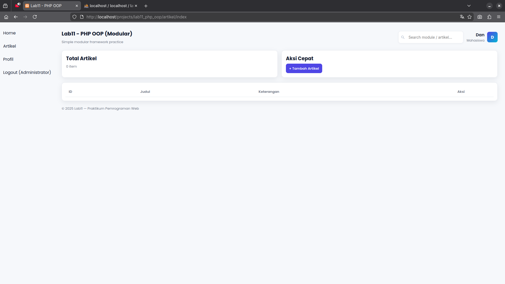
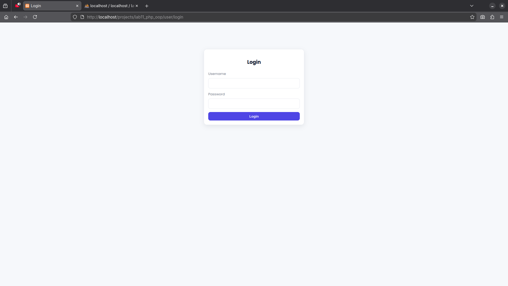
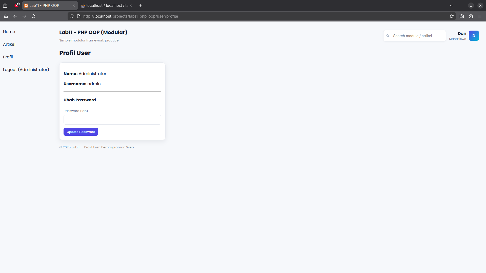

# Praktikum 12 – PHP OOP Login & Session

Project ini merupakan lanjutan dari Praktikum 11, dengan penambahan **sistem autentikasi (login)** menggunakan **PHP OOP dan session**.  
Aplikasi menerapkan pembatasan akses halaman, fitur profil user, serta perubahan password.

---

## Fitur Utama
- Login dan Logout user
- Manajemen session
- Proteksi halaman (akses dibatasi untuk user login)
- Halaman profil user
- Ubah password dengan enkripsi (`password_hash`)
- CRUD Artikel (Create, Read, Update, Delete)
- UI modern menggunakan CSS murni

---

## 1. Buat database:
```sql
CREATE DATABASE latihan_oop;
```
## 2. Buat Tabel
```sql
CREATE TABLE artikel (
    id INT AUTO_INCREMENT PRIMARY KEY,
    judul VARCHAR(100),
    keterangan TEXT
);

CREATE TABLE users (
    id INT AUTO_INCREMENT PRIMARY KEY,
    username VARCHAR(50),
    password VARCHAR(255),
    nama VARCHAR(100)
);
```
## Restart Xampp (Linux)
```bash
sudo /opt/lampp/lampp restart
```
---
# Screenshot
## Home Screen 

## Login Screen 

## Ubah Password 

